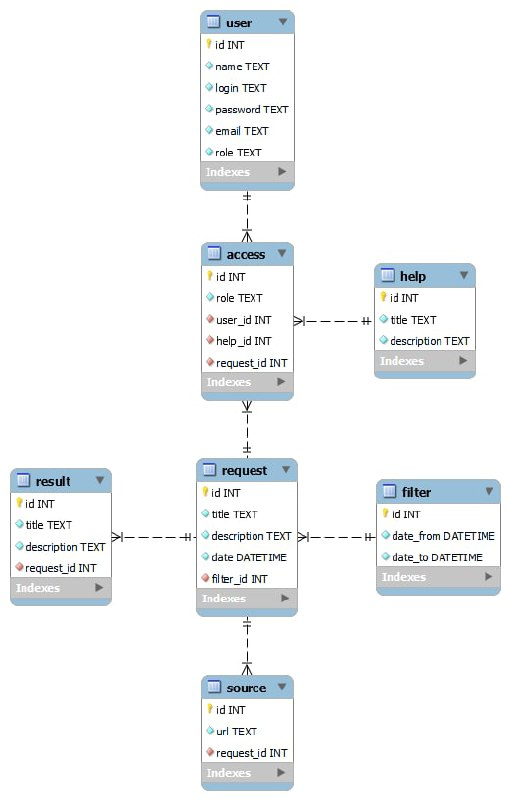

# Проєктування бази даних

## Модель бізнес-об'єктів
@startuml

entity User
entity User.name
entity User.login
entity User.password
entity User.email
entity User.role

User.name --* User
User.login --* User
User.password --* User
User.email --* User
User.role --* User

entity Access
entity Access.role

Access.role -u-* Access

entity Request
entity Request.id
entity Request.title
entity Request.description
entity Request.date

Request.id --* Request
Request.title --* Request
Request.description --* Request
Request.date --* Request

entity Help
entity Help.id
entity Help.title
entity Help.description

Help.id --* Help
Help.title --* Help
Help.description -u-* Help

Access "0,*" -u- "1,1" User
Access "0,*" -l- "1,1" Request
Access "0,*" -r- "1,1" Help

entity Source
entity Source.id
entity Source.url

Source.id -u-* Source
Source.url -u-* Source

entity Filter
entity Filter.date_from
entity Filter.date_to

Filter.date_from -u-* Filter
Filter.date_to -u-* Filter

entity Result
entity Result.id
entity Result.title
entity Result.description

Result.id -u-* Result
Result.title -u-* Result
Result.description -d-* Result

Request "0,1" -d- "1,1" Filter
Request "0,*" -d- "1,*" Source
Request "1,1" -d- "0,*" Result

@enduml

## ER-модель

@startuml

entity User {
name: TEXT
login: TEXT
password: TEXT
email: TEXT
role: TEXT
}

entity Request {
id: INT
title: TEXT
description: TEXT
date: DATETIME
}

entity Source {
id: INT
url: TEXT
}

entity Filter {
date_from: DATETIME
date_to: DATETIME
}

entity Help {
id: INT
title: TEXT
description: TEXT
}

entity Result {
id: INT
title: TEXT
description: TEXT
}

entity Access {
role: TEXT
}

User "1,1" -- "0,*" Access
Access "0,*" -- "1,1" Request
Access "0,*" -r- "1,1" Help
Request "0,*" -- "1,*" Source
Request "1,1" -u- "0,*" Result
Request "0,1" -r- "1,1" Filter

@enduml

## Реляційна схема

